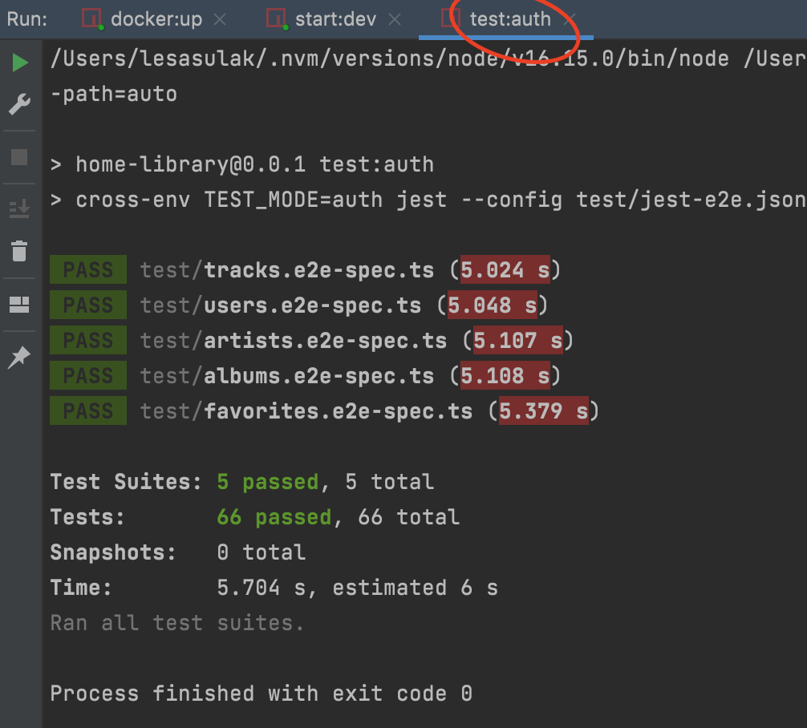

# Docker
link to docker hub with images https://hub.docker.com/repository/docker/alexdv/nodejs2022q2

npm script for vulnerabilities scanning

```
 npm run scan-node
 npm run scan-db
```


<<<<<<< HEAD
####Start app
1. add .env
2. start db local or on docker
3. start app ```npm run start:dev ```

###Tests




####Start app in docker

npm script for start app in docker (db + app)

```
  docker-compose up
```

# Home Library Service

## Prerequisites

- Git - [Download & Install Git](https://git-scm.com/downloads).
- Node.js - [Download & Install Node.js](https://nodejs.org/en/download/) and the npm package manager.

## Downloading

```
git clone {repository URL}
```

## Installing NPM modules

```
npm install
```

## Running application

```
npm start
```

After starting the app on port (4000 as default) you can open
in your browser OpenAPI documentation by typing http://localhost:4000/doc/.
For more information about OpenAPI/Swagger please visit https://swagger.io/.

## Testing

After application running open new terminal and enter:

To run all tests without authorization

```
npm run test
```

To run only one of all test suites

```
npm run test -- <path to suite>
```

To run all test with authorization

```
npm run test:auth
```

To run only specific test suite with authorization

```
npm run test:auth -- <path to suite>
```

### Auto-fix and format

```
npm run lint
```

```
npm run format
```

### Debugging in VSCode

Press <kbd>F5</kbd> to debug.

For more information, visit: https://code.visualstudio.com/docs/editor/debugging
